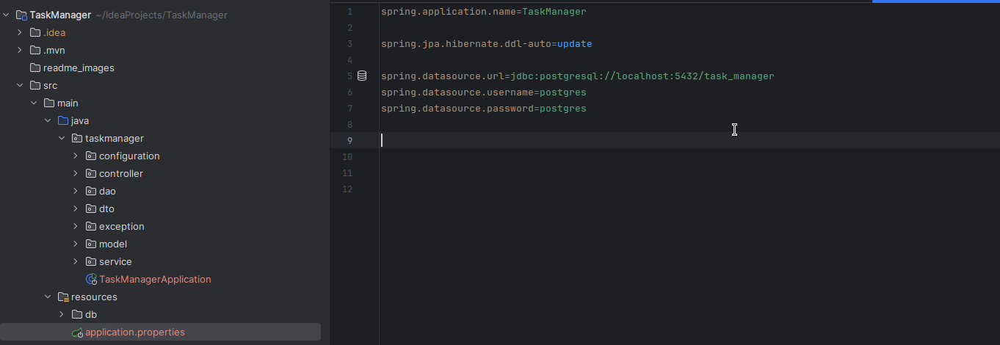

# Application for creating users in database and give them various tasks

A simple REST API application for adding, deleting, updating and retrieving user data and the ability to add tasks to them, delete tasks, view information about tasks and the like.

## Table of Contests

- [Introduction](#introduction)
- [Technologies Used](#technologies-used)
- [Getting Started](#getting-started)
    - [Prerequisites](#prerequisites)
    - [Installation](#installation)
- [Postman](#postman)
- [Endpoints](#endpoints)
- [Note](#note)

## Introduction

This is a basic REST API application built using [Spring Boot](https://spring.io/projects/spring-boot) framework and [Maven](https://maven.apache.org). You can read the technical specifications [here](techical_specifications).

## Technologies Used

- [Spring Boot](https://spring.io/projects/spring-boot): Web framework for building the REST API.
- [Spring Data JPA](https://spring.io/projects/spring-data-jpa): Data access framework based on Hibernate for interacting with the database.
- [PostgreSQL](https://www.postgresql.org): Database for local and global use.

## Getting Started

### Prerequisites

Make sure you have the following installed:

- Java (version 17 or higher)
- Maven
- PostgreSQL

## Installation

1. Clone the repository:

    ```bash
    git clone https://github.com/vanzoneway/TaskManager.git
    ```

2. Don't forget to change [application.properties](src/main/resources/application.properties) for your installed database.

- spring.datasource.url={your_datasource_url}
- spring.datasource.username={your_username}
- spring.datasource.password={your_password}

Note: You can initially run the database schema initialization script, which is located [here](src/main/resources/db/migration/V1_0__Initial_Structure.sql). You can also insert mock data ([here](src/main/resources/db/insert/V1_0_1__Mock_Data.sql)) to properly test this application. You can also change spring.jpa.hibernate.ddl-auto=update on create-drop so that the tables are deleted every time and created automatically using Spring Boot and Hibernate.

3. Build the project:

For Linux:
```bash
./mvnw clean install
```
For Windows:
```bash
mvnw.cmd clean install
```

4. Run the application:

```bash
java -jar target/TaskManager-0.0.1-SNAPSHOT.jar
```
Note: Double-check that you have created a user for your PostgreSQL with all the necessary rights and that you have created the database in which your tables will be created. Example for Linux Ubuntu [here](https://medium.com/devops-technical-notes-and-manuals/how-to-install-and-configure-postgresql-on-ubuntu-20-04-4fd3cf072d6f).


## Postman

You can see prepared requests for my API [here](https://www.postman.com/5479880zinovich/workspace/taskmanagerfordigitalchief)

## Endpoints


## Note


